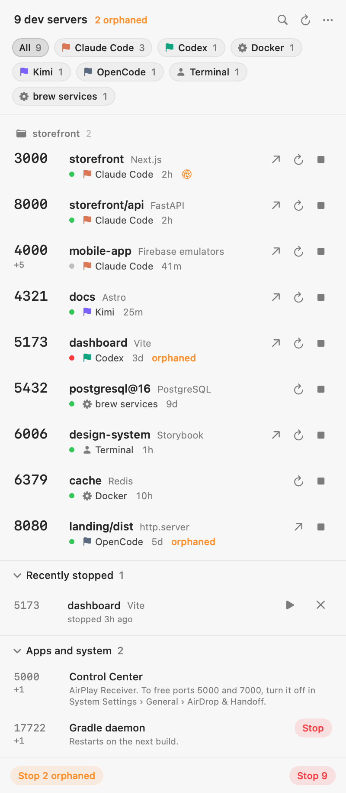

# Porthole

A menu bar app for macOS that shows every dev server running on your Mac, who started it, and lets you stop it.

Coding agents start servers and leave them running. After a week you have a Next.js app on 3000, three `http.server`s from some session you don't remember, and a Vite server whose terminal closed days ago. Porthole shows all of them, says which agent or terminal started each one, flags the orphans, and stops them cleanly.

<picture>
  <source media="(prefers-color-scheme: dark)" srcset="docs/screenshot-dark.png">
  
</picture>

## What it does

- **Lists every listening port you own**, grouped into servers: one row for Firebase emulators, not nine. Servers in the same project group together, with a **Stop project** button.
- **Says who started each one**: Claude Code, Codex, Gemini CLI, Kimi, OpenCode, Grok, Cursor, Copilot CLI, Amp, Aider and more, or which terminal or editor you ran it from.
- **Still knows after the agent is gone.** Agents leave markers in the environment of everything they run (`CLAUDECODE=1`, `CODEX_THREAD_ID`, `GEMINI_CLI=1`…), and those survive after the agent exits. That's how an orphaned server still gets a name.
- **Flags orphans**: servers whose terminal, agent or app no longer exists. One click stops them all, and the menu bar icon gets a badge dot while any exist.
- **Knows your Docker containers.** A port published by Docker Desktop or OrbStack gets the container's name and image, and Stop runs `docker stop` — signaling the port forwarder would cut networking for every container.
- **Checks that they answer.** A listening socket is not a working server — hung processes still listen. The dot next to each server is a live probe: HTTP for web servers, TCP connect for databases. Details show the response time.
- **Restarts and starts.** Exact executable, arguments and original working folder are saved separately. Restart uses these directly, or asks the local Docker/brew manager. When a process has renamed its command, review a launch recipe first. Startup waits up to 30 seconds for that job to own all expected ports; errors and logs stay available if it fails.
- **Stops the whole job, like Ctrl-C would.** Stop on a Next.js row ends `npm run dev`, `next dev` and `next-server` together, so nothing respawns.
- **Knows the special cases.** `brew services` get `brew services stop` instead of a kill that launchd would undo. macOS's AirPlay Receiver on port 5000 comes with instructions for turning it off.
- **Warns when a server is exposed** to everyone on your network, not just you — with the LAN address for opening it on your phone.
- **Lives in the keyboard.** ⌃⌥P toggles the panel from anywhere, ↑/↓ move between servers, → expands, ⌘O opens, ⌘⇧C copies the URL, ⌘⌫ stops, ⌘F searches.
- **Can watch for you.** Pin a service or project. A project pin follows an available service in that project; its dot reports that service's selected port. Optional notifications when a server appears, stops, or becomes orphaned are off by default.
- **Protects important services.** Choose **Protect service** from a row's menu to exclude it from stop, restart, force quit and bulk actions, including CLI stop. Protection persists across process restarts.
- **Remembers launch recipes.** Save project recipes from the project menu, then use **Start project** in the saved list. Edit executable, arguments, working folder and expected ports. Search includes saved and recently stopped services.
- **Explains each port.** Expand a row to choose HTTP, HTTPS or TCP, see its health, and open, copy or pin that endpoint. Large lists and expanded details scroll within the screen.
- **Keeps troubleshooting local.** Activity & diagnostics shows the last 100 lifecycle events and exports JSON only when you choose a file. The CLI also supports `--json`.

It's a native Swift app with no third-party dependencies. No Electron, no telemetry.

## Install

Download `Porthole-<version>.dmg` from the [latest release](https://github.com/infrasan/porthole/releases/latest), open it and drag Porthole to Applications. Check the release's signing and notarization status before distributing it. Local builds are ad-hoc signed unless you provide a Developer ID and notarization profile.

Requires macOS 14 or later.

See [the changelog](CHANGELOG.md) for release changes. To update, quit Porthole, replace the copy in Applications, then reopen it. Preferences and saved recipes remain in your user Library; there is no automatic updater.

## Build from source

Open `Porthole.xcodeproj` in Xcode 16 or later and press ⌘R.

Or from the terminal:

```bash
git clone https://github.com/infrasan/porthole.git && cd porthole
scripts/build.sh
open build/Porthole.app
```

`scripts/build.sh` builds a universal (Apple silicon and Intel) app and a DMG in `build/` with SwiftPM, no Xcode project needed. It verifies both architectures, checks the signature, and runs the packaged app for 10 seconds before packaging; only that disposable instance is closed.

## How it works

Porthole reads the process table and every process's sockets through `sysctl` and `libproc`, the same kernel interfaces `ps` and `lsof` use, without launching either. Scan cost depends on the process count and container manager; measure your Mac with `--bench`. It runs every 5 seconds in the background and every 2 seconds while the panel is open.

### Who started it

For each server, Porthole checks in this order:

1. **The live process tree.** It walks up from the server, and the first agent, editor or terminal it meets is the answer.
2. **Environment markers.** If the parent is gone, it looks for the variables agents set on commands they run:

   | Agent | Marker |
   | --- | --- |
   | Claude Code | `CLAUDECODE`, `CLAUDE_CODE_ENTRYPOINT` |
   | Codex | `CODEX_THREAD_ID`, `CODEX_SANDBOX`, `CODEX_MANAGED_BY_NPM` |
   | Gemini CLI | `GEMINI_CLI` |
   | OpenCode | `OPENCODE_CLIENT` |
   | Kimi | `KIMI_SESSION_ID` |
   | Grok | `GROK_SESSION_ID` |
   | Cursor Agent | `CURSOR_AGENT` |
   | Any agent | `AI_AGENT` |

3. **launchd.** `brew services` and other launchd jobs.
4. **The app it was launched from**, from `__CFBundleIdentifier` and `TERM_PROGRAM`.

Click a row to see the evidence for each answer.

Ports published by Docker Desktop or OrbStack are different: the listening socket belongs to a port forwarder (`vpnkit`, OrbStack Helper), not the container. When Porthole sees a forwarder, it queries `docker ps` and structured port-binding fields from `docker inspect` over that manager's local Unix socket to determine which container published each TCP port and shows one row per container — with the container's name, its image as the framework, and Stop mapped to `docker stop`. Remote Docker contexts and `DOCKER_*` overrides are ignored. If no container uniquely claims a port, the forwarder row shows up with Stop disabled, because signaling it would cut networking for every container.

### Health

Each server gets a probe on loopback: a HEAD request for things that speak HTTP (any response counts, even a 500 — the point is the process answers), a TCP connect for databases and other non-HTTP services. Green means answering (with the response time in the details), red means the port listens but nothing answers, grey means not checked. Probes run while the panel is open; in the background, only the selected port of a pinned service is probed, so nothing spams your servers' logs while you're not looking.

HTTP redirects are not followed, so a local redirect cannot make a probe contact an external address. IPv4 and IPv6 bindings are preserved. A listener bound only to a LAN address is marked unavailable for loopback probing. HTTPS checks verify certificates; an untrusted local certificate is shown as unavailable, not silently accepted. Unknown protocols default to TCP; use the per-port selector when a web server is not recognized. HTTP “up” means it answered, not that its application or dependencies are healthy.

### Grouping

Servers sharing a git root (or, without git, a working directory) group under one project header with its own Stop button. Frontend on 3000, API on 8000, same repo: one group.

### What Stop does

1. Walks up from the server through launchers that exist only for it (`npm run`, `npx`, `sh -c`) so the whole job ends. It never climbs into a shell you're typing in, a terminal, an editor or an agent.
2. Sends SIGINT to the job, like Ctrl-C. Processes started in the background with `&` ignore SIGINT, so they get SIGTERM straight away.
3. Sends SIGTERM to anything still running after 4 seconds, and SIGKILL after 2 more.

Before each signal it checks the process's start time, so a reused PID never gets signaled. Option-click Stop, or use **Force quit**, to send SIGKILL right away.

## Privacy

Everything stays on your Mac. Porthole makes no network requests of its own; the only connections it ever opens are loopback health checks to your own dev servers.

To identify agents it reads the environment of your own processes, the same way `ps -E` does. Only the variable names listed in [`Catalog.swift`](Sources/Porthole/Catalog.swift) are kept. Everything else, API keys included, is discarded while parsing and never stored or displayed.

Restarts execute the saved argument vector directly. They do not run login-shell setup or copy the original environment. The executable's directory and common system/Homebrew locations form PATH. Projects that need custom environment setup should use a reviewed project launcher; keep secrets in project configuration. Old stored command strings are retained only as non-executable metadata and need a reviewed recipe.

Recognizable credentials in command arguments are redacted from display and rejected from recipes. This is a heuristic, not a guarantee that arbitrary text contains no secrets; inspect diagnostic exports before sharing. No full environments are persisted. Output from launched programs goes to private files in `~/Library/Logs/Porthole/`; the newest 40 log files are retained. A running program's output is not size-capped or scrubbed, so it should avoid printing secrets. Saved recipes, recents and activity live in `~/Library/Application Support/Porthole/` with private permissions.

## Adding an agent

Agents, editors and terminals are one table in [`Sources/Porthole/Catalog.swift`](Sources/Porthole/Catalog.swift). Add an entry with the executable name and any environment variable the agent sets on commands it runs:

```swift
OwnerDef(id: "my-agent", name: "My Agent", kind: .agent, color: 0x7B61FF,
         executables: ["my-agent"], envKeys: ["MY_AGENT_SESSION"]),
```

Frameworks work the same way in [`Frameworks.swift`](Sources/Porthole/Frameworks.swift).

## Developer flags

```bash
.build/debug/Porthole --dump                  # print the scan as text
.build/debug/Porthole --json                  # redacted JSON scan; no upload
.build/debug/Porthole --bench                 # exits nonzero if consecutive scans differ
scripts/verify.sh                            # warning-free build, regression tests, fixtures
python3 scripts/soak.py                       # 3-minute live soak after scripts/build.sh
.build/debug/Porthole --stop 5173             # stop one eligible, unambiguous service on a port
.build/debug/Porthole --snapshot out.png      # render the panel to an image
.build/debug/Porthole --snapshot out.png --demo --dark --expand 5173
```

`--demo` renders made-up servers, so screenshots don't publish your project names. Snapshots cannot probe, signal processes, write history or change preferences. Failures return a nonzero exit status.

For native panel QA, a debug build supports `PORTHOLE_OPEN_PANEL=1`. Add `PORTHOLE_DEMO_PANEL=1 PORTHOLE_DEMO_COUNT=100` for an inert, synthetic large inventory (counts from 0 to 100). Do not use demo mode to test real stop/start actions.

GitHub Actions runs the verification script on macOS 14, current macOS, and an Intel runner. Only synthetic demo PNGs are uploaded. Real scan JSON and logs remain local. CI does not replace a live soak, manual keyboard/VoiceOver testing, or signing/notarization checks.

## Releasing

1. Bump **Version** (`MARKETING_VERSION`) in the project's General tab.
2. In Signing & Capabilities, choose your team.
3. Product › Archive, then Distribute App › **Direct Distribution**. Xcode signs the app with your Developer ID certificate (creating it if needed) and has Apple notarize it.
4. Export the app and wrap it in a DMG:

   ```bash
   scripts/make-dmg.sh ~/Desktop/Porthole/Porthole.app
   ```

5. Attach `build/Porthole-<version>.dmg` to a GitHub release.

Without Xcode, `scripts/build.sh` can sign and notarize too. Store notarization credentials once, then pass your identity:

```bash
xcrun notarytool store-credentials porthole --apple-id you@example.com --team-id TEAMID
DEVELOPER_ID="Developer ID Application: Your Name (TEAMID)" NOTARY_PROFILE=porthole VERSION=0.2.0 scripts/build.sh
```

## License

MIT
